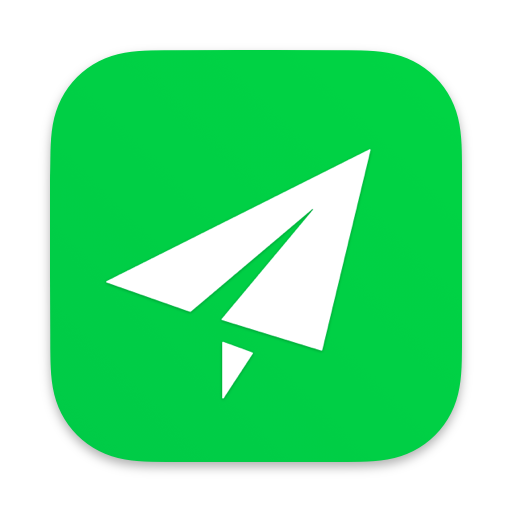
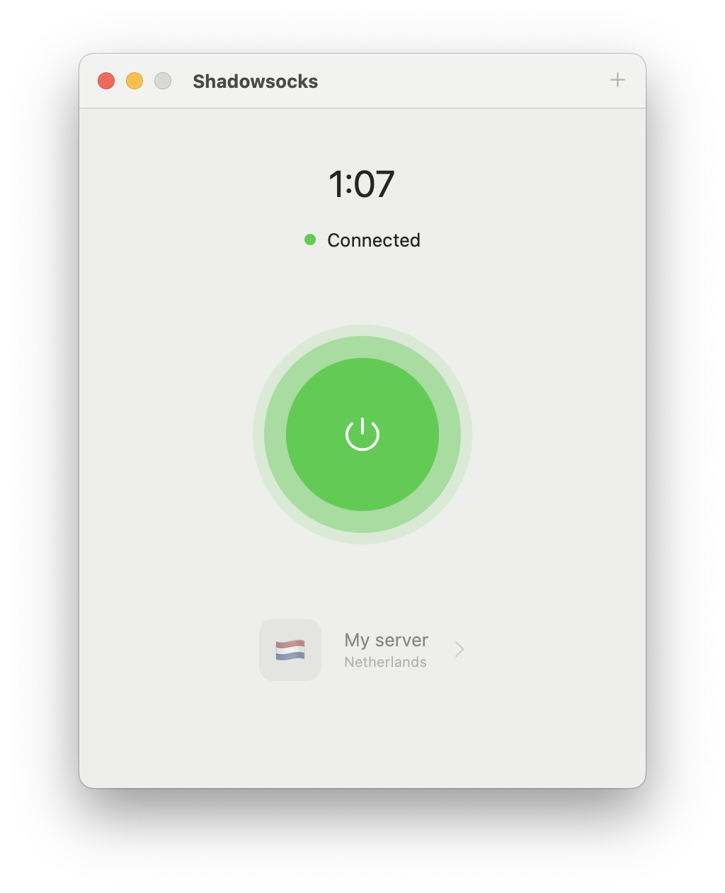
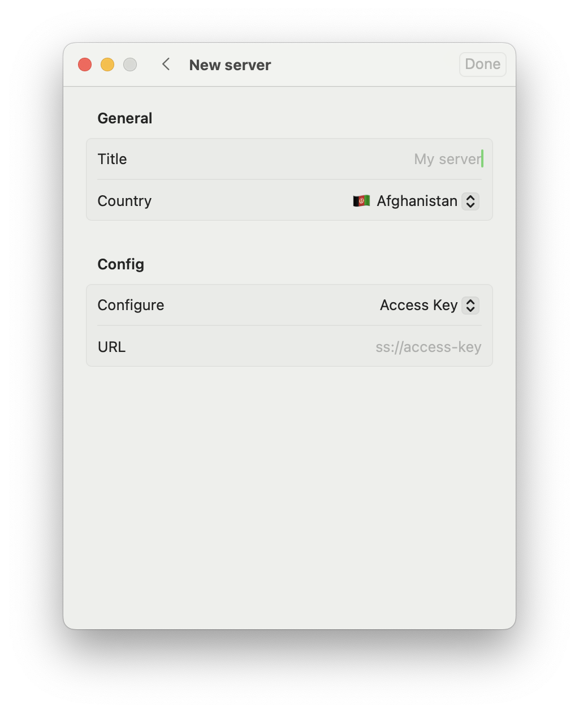
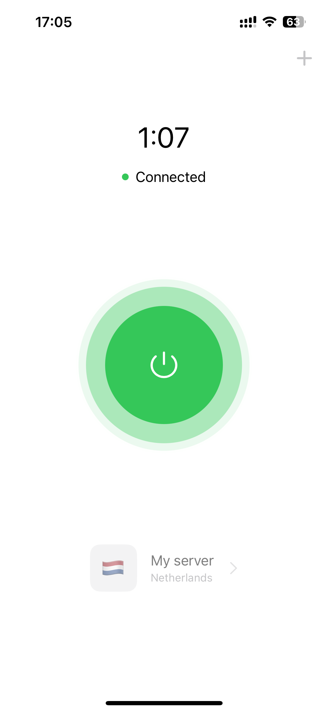
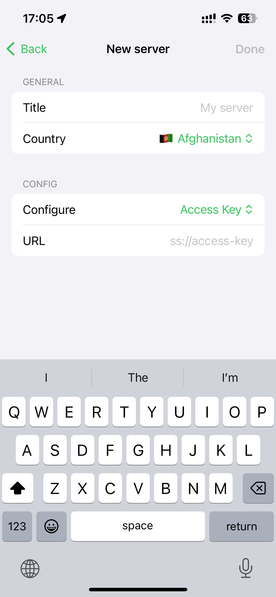
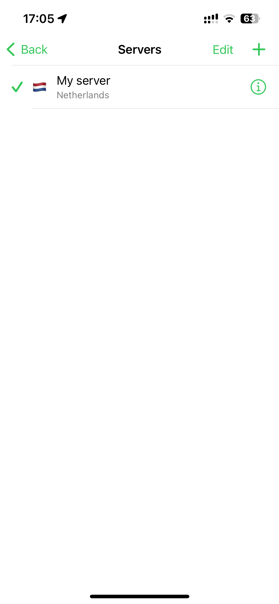

<!-- Improved compatibility of back to top link: See: https://github.com/othneildrew/Best-README-Template/pull/73 -->
<a id="readme-top"></a>
<!--
*** Thanks for checking out the Best-README-Template. If you have a suggestion
*** that would make this better, please fork the repo and create a pull request
*** or simply open an issue with the tag "enhancement".
*** Don't forget to give the project a star!
*** Thanks again! Now go create something AMAZING! :D
-->


<!-- PROJECT SHIELDS -->
<!--
*** I'm using markdown "reference style" links for readability.
*** Reference links are enclosed in brackets [ ] instead of parentheses ( ).
*** See the bottom of this document for the declaration of the reference variables
*** for contributors-url, forks-url, etc. This is an optional, concise syntax you may use.
*** https://www.markdownguide.org/basic-syntax/#reference-style-links
-->
[![Contributors][contributors-shield]][contributors-url]
[![Forks][forks-shield]][forks-url]
[![Stargazers][stars-shield]][stars-url]
[![Issues][issues-shield]][issues-url]
[![MIT License][license-shield]][license-url]
[![LinkedIn][linkedin-shield]][linkedin-url]


<!-- PROJECT LOGO -->
<br />
<div align="center">
  <a href="images/logo.png">
    
  </a>

  <h3 align="center">Shadowsocks Client</h3>

  <p align="center">
    Cross-platform lightweight client for Shadowsocks for macOS, iPadOS and iOS
    <br />
    <a href="https://github.com/apriakhin/shadowsocks-client"><strong>Explore the docs »</strong></a>
    <br />
    <br />
    <a href="https://github.com/apriakhin/shadowsocks-client">View Demo</a>
    ·
    <a href="https://github.com/apriakhin/shadowsocks-client/issues/new?labels=bug&template=bug-report---.md">Report Bug</a>
    ·
    <a href="https://github.com/apriakhin/shadowsocks-client/issues/new?labels=enhancement&template=feature-request---.md">Request Feature</a>
  </p>
</div>


<!-- TABLE OF CONTENTS -->
<details>
  <summary>Table of Contents</summary>
  <ol>
    <li>
      <a href="#about-the-project">About The Project</a>
      <ul>
        <li><a href="#built-with">Built With</a></li>
      </ul>
    </li>
    <li>
      <a href="#getting-started">Getting Started</a>
      <ul>
        <li><a href="#prerequisites">Prerequisites</a></li>
        <li><a href="#installation">Installation</a></li>
      </ul>
    </li>
    <li><a href="#usage">Usage</a></li>
    <li><a href="#roadmap">Roadmap</a></li>
    <li><a href="#contributing">Contributing</a></li>
    <li><a href="#license">License</a></li>
    <li><a href="#contact">Contact</a></li>
    <li><a href="#acknowledgments">Acknowledgments</a></li>
  </ol>
</details>


<!-- ABOUT THE PROJECT -->
## About The Project

<div align="center">
  <a href="images/macOS-connection-screenshot.png"></a><a href="images/macOS-new-screenshot.png"></a><a href="images/macOS-servers-screenshot.png"></a>
</div>

<div align="center">
  <a href="images/iOS-connection-screenshot.png"></a><a href="images/iOS-new-screenshot.png"></a><a href="images/iOS-servers-screenshot.png"></a>
</div>

<br>

Shadowsocks Client is your ideal tool for secure and anonymous web surfing. This lightweight yet powerful application allows you to easily manage your Shadowsocks servers and connections. Enjoy fast and convenient internet access with our key features.

Key Features:
- Server Connection: Quickly connect to your Shadowsocks servers for instant internet access.
- Server Management: Add and edit servers using configurations, URLs, or by scanning QR codes.
- Easy Connection Management: Control your connections with Shortcuts for greater flexibility and control.

<p align="right">(<a href="#readme-top">back to top</a>)</p>


### Built With

* [![Swift][Swift]][Swift-url]
* [![SwiftUI][SwiftUI]][SwiftUI-url]
* [![SwiftData][SwiftData]][SwiftData-url]

<p align="right">(<a href="#readme-top">back to top</a>)</p>


<!-- GETTING STARTED -->
## Getting Started

### Prerequisites

* Xcode 15.4

### Installation

1. Clone the repo
   ```sh
   git clone git@github.com:apriakhin/shadowsocks-client.git
   ```
2. Open `ShadowsocksClient.xcodeproj`

3. Start project

<p align="right">(<a href="#readme-top">back to top</a>)</p>


<!-- USAGE EXAMPLES -->
## Usage

You need your own or a public Shadowsocks server, you can use a access key or config to connect to the server. After adding a server, you can connect in one-touch, and you can set up automation via Shortcuts.

<p align="right">(<a href="#readme-top">back to top</a>)</p>


<!-- ROADMAP -->
## Roadmap

- [x] Add basic management of servers
- [x] Add connecting to the server
- [x] Add diplink support for QR
- [x] Add app intents support
- [ ] Add menubar for macOS
- [ ] Add unit tests
- [ ] Multi-language support
    - [x] English 
    - [x] Russian
    - [x] Chinese
    - [ ] German
    - [ ] Spanish
    - [ ] French

See the [open issues](https://github.com/apriakhin/shadowsocks-client/issues) for a full list of proposed features (and known issues).

<p align="right">(<a href="#readme-top">back to top</a>)</p>


<!-- CONTRIBUTING -->
## Contributing

Contributions are what make the open source community such an amazing place to learn, inspire, and create. Any contributions you make are **greatly appreciated**.

If you have a suggestion that would make this better, please fork the repo and create a pull request. You can also simply open an issue with the tag "enhancement".
Don't forget to give the project a star! Thanks again!

1. Fork the Project
2. Create your Feature Branch (`git checkout -b feature/AmazingFeature`)
3. Commit your Changes (`git commit -m 'Add some AmazingFeature'`)
4. Push to the Branch (`git push origin feature/AmazingFeature`)
5. Open a Pull Request

<p align="right">(<a href="#readme-top">back to top</a>)</p>


<!-- LICENSE -->
## License

Distributed under the MIT License. See `LICENSE.txt` for more information.

<p align="right">(<a href="#readme-top">back to top</a>)</p>


<!-- CONTACT -->
## Contact

Anton Priakhin - [@apriakhin](https://t.me/apriakhin) - apriakhin@aol.com

Project Link: [https://github.com/apriakhin/shadowsocks-client](https://github.com/apriakhin/shadowsocks-client)

<p align="right">(<a href="#readme-top">back to top</a>)</p>


<!-- ACKNOWLEDGMENTS -->
## Acknowledgments

* [Shadowsocks](https://shadowsocks.org)
* [Tun2socks](https://github.com/xjasonlyu/tun2socks)
* [outline-apps](https://github.com/Jigsaw-Code/outline-apps/tree/master)
* [outline-go-tun2socks](https://github.com/Jigsaw-Code/outline-go-tun2socks)

<p align="right">(<a href="#readme-top">back to top</a>)</p>


<!-- MARKDOWN LINKS & IMAGES -->
<!-- https://www.markdownguide.org/basic-syntax/#reference-style-links -->
[contributors-shield]: https://img.shields.io/github/contributors/apriakhin/shadowsocks-client.svg?style=for-the-badge
[contributors-url]: https://github.com/apriakhin/shadowsocks-client/graphs/contributors
[forks-shield]: https://img.shields.io/github/forks/apriakhin/shadowsocks-client.svg?style=for-the-badge
[forks-url]: https://github.com/apriakhin/shadowsocks-client/network/members
[stars-shield]: https://img.shields.io/github/stars/apriakhin/shadowsocks-client.svg?style=for-the-badge
[stars-url]: https://github.com/apriakhin/shadowsocks-client/stargazers
[issues-shield]: https://img.shields.io/github/issues/apriakhin/shadowsocks-client.svg?style=for-the-badge
[issues-url]: https://github.com/apriakhin/shadowsocks-client/issues
[license-shield]: https://img.shields.io/github/license/apriakhin/shadowsocks-client.svg?style=for-the-badge
[license-url]: https://github.com/apriakhin/shadowsocks-client/blob/master/LICENSE.txt
[linkedin-shield]: https://img.shields.io/badge/-LinkedIn-black.svg?style=for-the-badge&logo=linkedin&colorB=555
[linkedin-url]: https://linkedin.com/in/apriakhin
[Swift]: https://img.shields.io/badge/swift-F05138?style=for-the-badge&logo=swift&logoColor=white
[Swift-url]: https://www.swift.org
[SwiftUI]: https://img.shields.io/badge/swiftui-1E88E5?style=for-the-badge&logo=swift&logoColor=white
[SwiftUI-url]: https://developer.apple.com/xcode/swiftui/
[SwiftData]: https://img.shields.io/badge/swiftdata-gray?style=for-the-badge&logo=swift&logoColor=white
[SwiftData-url]: https://developer.apple.com/xcode/swiftdata/
